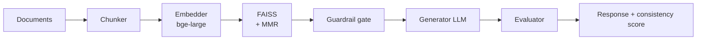

# RAG Pipeline AI

### Production-grade Retrieval-Augmented Generation pipeline for grounded, low-hallucination question answering.

**Latest update:** FastAPI service layer implemented and Docker image verified (builds + `/health` passes). Deploy with Docker or Docker Compose. See [DEPLOYMENT.md](docs/DEPLOYMENT.md) and [API.md](docs/API.md).

Engineering recruiter summary: A modular, production-oriented RAG system with a FastAPI service, FAISS semantic retrieval, guardrail + evaluation stages, OpenTelemetry observability, and a reproducible RAGAS evaluation harness. Quality is measured by a runnable evaluation pipeline rather than asserted (see [Key Metrics](#key-metrics)).

> **Status**: v1.0 — RAG pipeline with retrieval, guardrail-gate, generation, and evaluation stages, a FastAPI service, and a Docker image. Quantitative quality metrics are produced by the RAGAS harness in [`eval_ragas.ipynb`](eval_ragas.ipynb); see [Key Metrics](#key-metrics) for current measured/pending status.


<!-- TODO: Add deployment status badge (e.g., Railway/Render/Fly.io) -->

This system ingests text knowledge sources (plain strings and `.txt` files), transforms them into semantic vector representations, and retrieves the best evidence before generation. It combines retrieval, MMR diversity re-ranking, a guardrail gate, generation, and an evaluation stage to deliver grounded responses with a reproducible quality-measurement harness.

## Recruiter Snapshot

| Category | Snapshot |
|---|---|
| Project type | Retrieval-Augmented Generation (RAG) AI system |
| Core technologies | Python, FAISS, sentence-transformers, OpenAI-compatible LLM (Groq/OpenAI), FastAPI, Docker, OpenTelemetry |
| Quality measurement | RAGAS harness (faithfulness, answer relevancy, context precision/recall) over a 22-sample grounded set — see [Key Metrics](#key-metrics) |
| Measured latency | ~9.3s mean end-to-end per query (sync-evaluator mode, llama-3.3-70b via Groq; see [report](evaluation/reports/ragas-run-2026-06-23.json)) |
| Deployment readiness | Verified Docker image (builds + `/health` passes); modular components; container-friendly stack |

## Table of Contents

- [What This Project Does](#what-this-project-does)
- [Features](#features)
- [Architecture](#architecture)
- [Key Metrics](#key-metrics)
- [Tech Stack](#tech-stack)
- [Setup Instructions](#setup-instructions)
- [API and Usage Example](#api-and-usage-example)
- [Folder Structure](#folder-structure)
- [Demo and Visuals](#demo-and-visuals)
- [Why This Project Matters](#why-this-project-matters)
- [Future Improvements](#future-improvements)
- [Contribution](#contribution)
- [License](#license)
- [README Quality and Credibility](#readme-quality-and-credibility)

## What This Project Does

The pipeline processes text content into token-aware chunks, embeds them with sentence-transformers, and indexes them in FAISS for semantic retrieval at query time. Retrieved evidence is diversity-re-ranked (MMR), passed through a guardrail gate, and handed to the LLM so final answers are more relevant, more explainable, and less prone to hallucination.

## Features

- Text ingestion (plain strings / `.txt`) with token-aware, overlapping chunking
- Embedding generation (`bge-large-en-v1.5`) and FAISS semantic vector indexing
- MMR diversity re-ranking with a configurable similarity threshold
- Guardrail gate and an LLM evaluator that scores answer/context consistency
- OpenTelemetry traces, metrics, and structured logs with local Grafana/Prometheus examples
- RAGAS evaluation harness with a grounded dataset and quality reports
- Clean module boundaries for production-oriented extension and testing

## Architecture

### Mermaid Flowchart



### ASCII Pipeline

```text
[Documents] -> [Chunker] -> [Embedder] -> [FAISS + MMR] -> [Guardrail] -> [Generator LLM] -> [Evaluator] -> [Response]
```

## Key Metrics

Metrics here come from a **reproducible evaluation harness**, not hand-typed numbers. The harness
([`eval_ragas.ipynb`](eval_ragas.ipynb) / [`evaluation/run_ragas.py`](evaluation/run_ragas.py)) runs a
22-question grounded set through the real pipeline and scores it with RAGAS.

**Latency — measured (n=22, sync-evaluator mode, llama-3.3-70b via Groq):**

| Metric | Value |
|---|---:|
| Mean end-to-end latency | ~9.3 s |
| Median | ~9.5 s |
| p95 | ~12.5 s |
| Range | 2.6 s – 14.2 s |

> Latency is config-dependent: `evaluator_mode=sync` adds a second verification LLM call per query, and
> these numbers include provider queueing. Deferred-evaluation mode returns the answer before evaluation
> and is lower. Source: [`evaluation/reports/ragas-run-2026-06-23.json`](evaluation/reports/ragas-run-2026-06-23.json).

**RAGAS quality metrics (faithfulness, answer relevancy, context precision, context recall):**
implemented and runnable, but the most recent run only completed ~28% of judge calls before the free-tier
provider hit its **daily token cap**, so these are currently **NOT VERIFIED**. Re-run
`python -m evaluation.run_ragas` with available quota to populate them; the harness writes results to
`evaluation/reports/ragas-latest.json`.

<!-- When a full RAGAS run completes, replace the line above with the measured faithfulness/relevancy/precision/recall values from evaluation/reports/ragas-latest.json -->

## Tech Stack

| Layer | Technology |
|---|---|
| Language | Python 3.11 |
| Pipeline orchestration | Custom (no external agent framework) |
| LLM | OpenAI-compatible API (tested with Groq `llama-3.3-70b-versatile` and OpenAI) |
| Embeddings | sentence-transformers (`BAAI/bge-large-en-v1.5`, 1024-d) |
| Vector Index | FAISS (flat / IVF / HNSW) with MMR |
| API Layer | FastAPI + Gunicorn/Uvicorn |
| Observability | OpenTelemetry (traces, metrics, structured logs) |
| Evaluation | RAGAS |
| Containerization | Docker |

## Setup Instructions

### 1) Clone Repository

```bash
git clone https://github.com/satyamshivam13/RAG_Pipeline.git
cd RAG_Pipeline
```

### 2) Create and Activate Virtual Environment

```bash
python -m venv .venv
.venv\Scripts\activate
```

### 3) Install Dependencies

```bash
pip install -r requirements.txt
```

### 4) Configure Environment Variables

```bash
copy .env.example .env
```

Example .env values:

```env
OPENAI_API_KEY=your_openai_api_key
OPENAI_MODEL=gpt-4o-mini
```

### 5) Run the System

Interactive demo:

```bash
python demo.py
```

Offline evaluation (deterministic, CI quality gates):

```bash
python -m evaluation.run_eval --dataset evaluation/datasets/phase2_eval.jsonl --output evaluation/reports/phase2-latest.json
python -m evaluation.quality_gates --report evaluation/reports/phase2-latest.json
```

RAGAS evaluation (faithfulness / answer relevancy / context precision / recall):

```bash
# Requires a valid OPENAI_API_KEY (any OpenAI-compatible endpoint, e.g. Groq via LLM_BASE_URL)
python -m evaluation.run_ragas \
  --corpus evaluation/datasets/ragas_corpus.json \
  --dataset evaluation/datasets/ragas_eval.jsonl \
  --output evaluation/reports/ragas-latest.json
# or run the notebook end-to-end:  jupyter lab eval_ragas.ipynb
```

> Note: RAGAS makes many judge-LLM calls. On a free-tier provider you may hit a daily token cap before
> the full 22-sample run completes — use a paid/higher-quota key or re-run after the quota resets.

Run tests:

```bash
pytest tests/ -v
```

## API and Usage Example

```python
from config import PipelineConfig, RuntimeConfig
from main import RAGPipeline

config = PipelineConfig(runtime=RuntimeConfig(evaluator_mode="sync"))
pipeline = RAGPipeline(config)

pipeline.ingest([
    "RAG combines retrieval and generation for grounded answers.",
    "Vector databases support semantic search over embeddings.",
])

result = pipeline.query("How does RAG reduce hallucination?")
print(result.answer)
print(result.consistency_score)
```

## Folder Structure

```text
RAG_Pipeline/
|- config.py
|- main.py
|- demo.py
|- document_loader.py
|- embeddings.py
|- retriever.py
|- vector_store.py
|- generator.py
|- guardrail_agent.py
|- evaluator_agent.py
|- llm_client.py
|- evaluation/
|  |- run_eval.py
|  |- quality_gates.py
|  |- datasets/
|- tests/
|- docs/
|- requirements.txt
|- README.md
```

## Demo and Visuals

<!-- TODO: Replace with real product screenshot -->


<!-- TODO: Replace with recorded walkthrough GIF -->


<!-- TODO: Add live demo or deployment URL -->
<!-- Live Demo: https://your-live-demo-url -->
<!-- Deployment URL: https://your-deployment-url -->

Tip: A short 15-30 second walkthrough showing ingest -> query -> grounded response is highly effective for recruiter and judge review.

## Why This Project Matters

RAG systems power practical AI use cases such as internal knowledge assistants, support copilots, legal and policy search, and technical documentation QA. By grounding generation in retrieved evidence, this approach materially reduces hallucinations while improving traceability and response relevance.

From an engineering standpoint, semantic retrieval enables better knowledge utilization than keyword search alone, especially for paraphrased or domain-specific queries. This project reflects production AI engineering priorities: measurable quality gates, modular architecture, and maintainable retrieval-generation workflows.

## Future Improvements

- ✅ **FastAPI endpoints** (sync/streaming/health; `/query` per-request overrides fixed)
- ✅ **Dockerfile + docker-compose** (multi-stage, non-root, verified `/health`)
- ✅ **RAGAS evaluation harness** (runnable notebook + runner + grounded dataset)
- Slim the Docker image (CPU-only torch / externalize embeddings) from ~9.3 GB
- Add hybrid retrieval (dense + sparse / BM25) with weighted rank fusion
- Add a cross-encoder re-ranking stage (beyond MMR)
- Add observability dashboards for latency, relevance, and failure analytics
- Add GraphQL API option alongside REST
- Implement request/response caching with Redis
- Add persistent evaluation metrics and analytics pipeline

## Docker & Local Deployment

This repository includes a production-focused `Dockerfile` and `docker-compose.yml` to run the FastAPI service locally or in production.

Quick start (build + run with Docker Compose):

```bash
# Copy example env and edit values (OPENAI_API_KEY required for full functionality)
cp .env.example .env
# Edit .env and set OPENAI_API_KEY and other values

# Build and start the stack
docker-compose up -d --build

# Check container health
docker-compose ps
docker-compose logs -f rag-api

# Access the API docs
open http://localhost:8000/docs
```

Build single Docker image and run:

```bash
docker build -t rag-pipeline:latest .
docker run --rm -p 8000:8000 \
    -e OPENAI_API_KEY="$OPENAI_API_KEY" \
    -e RAG_API_TOKEN="$RAG_API_TOKEN" \
    -v $(pwd)/vector_store_data:/app/vector_store_data \
    rag-pipeline:latest
```

Notes:
- The image uses a multi-stage build and a Python virtual environment for a reproducible runtime. Note it is **large (~9.3 GB)** because it bundles PyTorch + sentence-transformers for local embeddings; slimming it (CPU-only torch wheel, or an external embedding service) is a tracked improvement.
- On first start the container downloads the `bge-large-en-v1.5` model (~1.3 GB) and loads it before serving, so **cold start takes ~1–2 minutes**. Mount a host HuggingFace cache (`-v $HOME/.cache/huggingface:/home/app/.cache/huggingface`) to avoid re-downloading. The Dockerfile healthcheck `--start-period` should be raised accordingly.
- The container runs as a non-root user (`app`) for improved security.
- The `vector_store_data` volume is persisted on the host to retain indexed vectors between restarts.
- `start.sh` is the entrypoint and execs the provided CMD; the image runs under `gunicorn` by default (override workers via `GUNICORN_WORKERS`).
- Verified locally: image builds, and `GET /health` returns `{"status":"healthy"}` with embeddings, vector_store, and llm all healthy.


## Contribution

Contributions are welcome.

1. Fork the repository
2. Create a feature branch named feat/your-feature
3. Commit changes with a clear message
4. Push your branch
5. Open a pull request with technical context and tests

Please keep changes focused, documented, and test-backed.

## License

This project is licensed under the MIT License.
See the LICENSE file for full terms.

## README Quality and Credibility

A high-quality README significantly increases GitHub credibility, recruiter trust, and open-source discoverability. Clear architecture, reproducible setup, and measurable outcomes help reviewers quickly evaluate engineering maturity and project impact.
