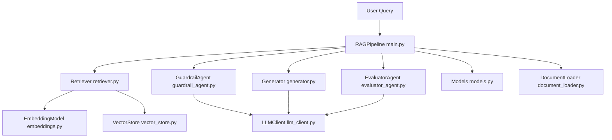

<!-- generated-by: gsd-doc-writer -->
# Architecture

## System Overview

The system is a layered Python RAG pipeline that accepts a user query plus ingested documents and returns an answer with retrieval traces, guardrail output, and factual consistency evaluation.

## Component Diagram



## Data Flow

1. Documents are ingested via `RAGPipeline.ingest` or `RAGPipeline.ingest_documents`, chunked by `DocumentLoader`, embedded by `EmbeddingModel`, then stored in `VectorStore`.
2. A query enters `RAGPipeline.query`, which calls `Retriever.retrieve`.
3. Retriever embeds the query and executes FAISS search (`search` or `mmr_search`) in `VectorStore`.
4. Retrieved chunks are threshold-filtered and optionally passed through `GuardrailAgent.evaluate`.
5. `Generator.generate` produces a grounded response using selected context chunks.
6. `EvaluatorAgent.evaluate` runs in sync or deferred mode and scores factual consistency claim-by-claim.
7. `PipelineResult` returns answer, reliability score, stage outputs, and total timing.

## Key Abstractions

- `RAGPipeline` in `main.py`: end-to-end orchestrator and public API.
- `PipelineConfig` and nested config dataclasses in `config.py`: centralized runtime, model, retrieval, and chunking controls.
- `LLMClient` in `llm_client.py`: OpenAI-compatible chat client with retry and JSON mode helpers.
- `EmbeddingModel` in `embeddings.py`: sentence-transformers wrapper with dimension validation.
- `VectorStore` in `vector_store.py`: FAISS index management, search/MMR, persistence.
- `Retriever` in `retriever.py`: embed-query and ranking orchestration.
- `GuardrailAgent` in `guardrail_agent.py`: relevance and safety filtering using JSON LLM output.
- `Generator` in `generator.py`: grounded answer generation with context token budgeting.
- `EvaluatorAgent` in `evaluator_agent.py`: factual consistency decomposition and scoring.
- `PipelineResult` and related pydantic models in `models.py`: typed contracts between stages.

## Directory Structure Rationale

```text
.
|- main.py                # Pipeline orchestration entry point
|- config.py              # All runtime/config dataclasses
|- models.py              # Shared typed data contracts
|- llm_client.py          # LLM transport and retries
|- embeddings.py          # Embedding model wrapper
|- vector_store.py        # FAISS storage and retrieval
|- document_loader.py     # Loading and chunking
|- retriever.py           # Query retrieval path
|- guardrail_agent.py     # Relevance and safety stage
|- generator.py           # Answer generation stage
|- evaluator_agent.py     # Consistency evaluation stage
|- demo.py                # Interactive demo runner
|- tests/                 # Unit/runtime behavior tests
|- docs/                  # Project documentation
```

This structure keeps each pipeline concern isolated to a module while `main.py` composes those modules into a single query interface.
